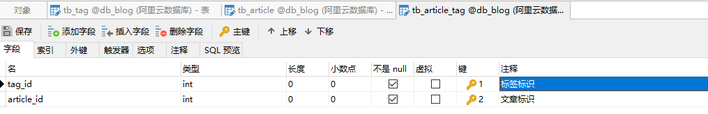
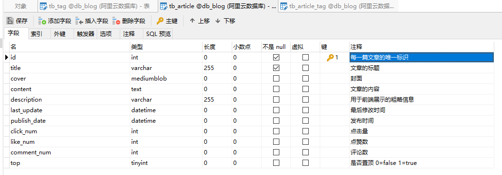
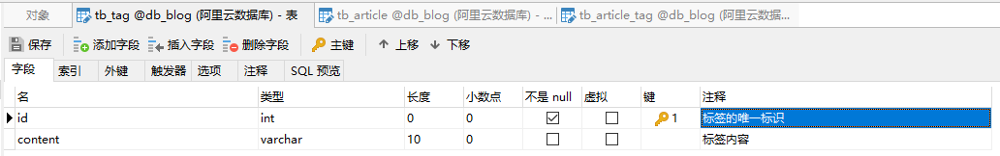
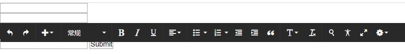
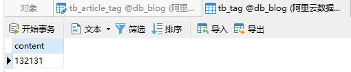
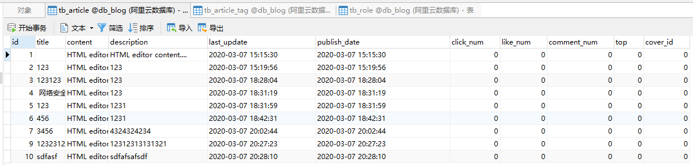
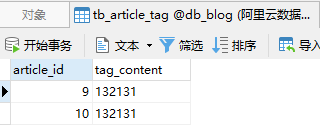
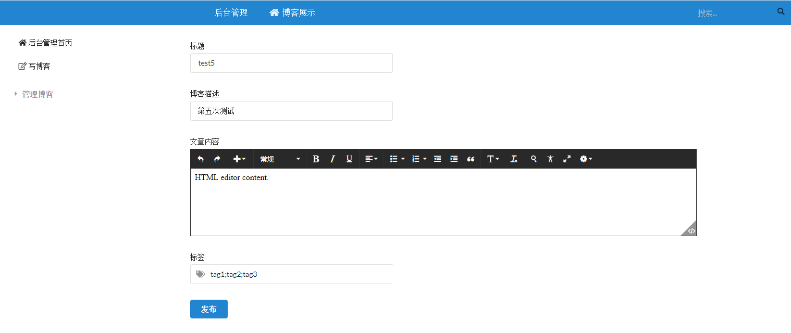

# Development Diary

### 3.5 一切的开始

俗话说万事开头难，今天是这个博客项目开发的第一天，作为一个新手我也毫无头绪应该从何开始，总没有理由一开始就写代码吧。在想怎么写这个项目之前先想一想这个项目需要达到什么样的功能：后台管理包括了编写文章、管理评论和用户等功能。而这一切的基础都应该是从设计数据库开始。

数据库表名以`tb_`作为开头，而后面则是实体名。首先先开始完成的功能是博客的编写和存储，先建立文章表`tb_article`和标签表`tb_tag`以及它们的多对多关系表`tb_article_tag`。







好了，数据库有了那么我们就开始编写功能了。

### 3.7-3.8 博客编写

隔了1天继续开干，之前已经把三张表简单的设计了一下，经过测试我又把其中的一些细节改了一下：把标签表直接用标签内容作为主键（虽然有点不好），理所当然地把文章和标签的表原来的标签id部分改为标签内容。

简单的编写了一下页面，不带任何样式，富文本编辑器是使用一款叫做textboxio的编辑器：



数据库中已经有了一些数据（之前测试的时候搞的）：







TODO：

* 后台管理的其他功能
* 加上一个博客可以对应多个标签的功能
* 页面这一块可能放到很后面才搞好看点
### 3.9-3.10 后台页面1
这两天稍微写了一下编写博客的界面让它好看了一点



同时完成了博客与标签多对多的保存功能，在这其中遇到了不少的坑。

1. 一开始的思路是直接使用jpa中的多对多注解来完成功能，该方法实现了多对多的三表保存，然而我认为这样做是不完美的。因为我希望的效果是内容相同的标签不会重复进入标签表中，而这样的话不管内容相不相同id都会是另外的，所以无法完成我想要的效果。

2. 后来我还是使用jpa中的多对多注解，并试图把标签表只保留了内容字段，即一个表只有一个字段并且为主键~~(废话)~~，这时候如果保存的文章的标签在数据库中已经存在的话，就会报出主键冲突的错误。

3. 秉持着能使用别人写好的东西就去用的理念，我咨询了大佬们。但他们给我的建议是：使用jpa进行单表查询，自己写这个级联持久化的过程，因为使用这些注解的话业务会难以维护。后来我想想也是这么个道理，并感觉自己就是个弱智。

   

ojbk，那就分开写，毕竟也不是什么难事对吧。

这期间调试的时候遇到了两个错误：

```verilog
1.javax.persistence.EntityExistsException: A different object with the same id

2.java.sql.SQLException: Field 'id' doesn't have a default value
```

面向百度编程嘛，第一个问题无论在百度还是StackOverflow上都是让我加上重写equal和hashcode方法，我想我明明加了lombok的`@EqualsAndHashCode`和`@Data`注解却都还是不行，只好老老实实用idea重写上述两个方法。

第二个问题是因为我对标签的存储方法而产生的，当时并没有对不存在的标签给上一个初始值，因此会出现这样的问题。

### 3.11-3.15 摸鱼

继续完善了一下后台的crud功能。

