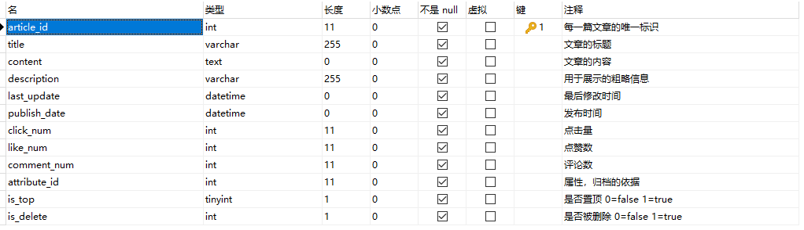
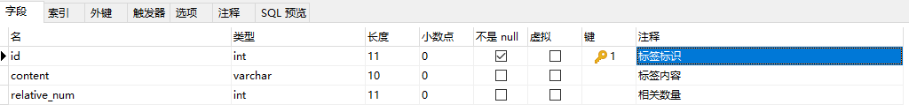
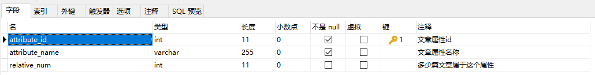
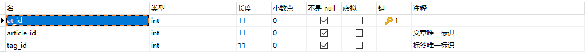

## 4.6 My Blog

#### 文章部分的数据库设计

​		设计文章表 tb_article：

​		设计标签表 tb_tag：

​		设计属性表 tb_attribute：

​		由于文章和标签是多对多的关系，所以需要设计一张表来存储它们之间的关系 tb_article_tag：

​		因为文章与文章属性是一对一的关系，因此只需要在文章表中的attribute_id字段设置上外键即可。

​		思考了一下，因为比较多的时候无论是访客还是后台管理，对文章表中的内容字段并非经常访问，在原来的设计中是希望从表中查找到的实体再转换为一个数据传输类（dto），然后再传送给前端。这样做其实并不好，于是我将文章内容从原来的数据库表中抽离出来形成一个新的表，当然了，主键是tb_article里面的article_id。

#### 测试设计与实现

​		页面测试的数据：

测试的结果：

 * 文章内容

   

 * 文章简要信息

   

 * 标签

   

 * 文章与标签关系

   

   

